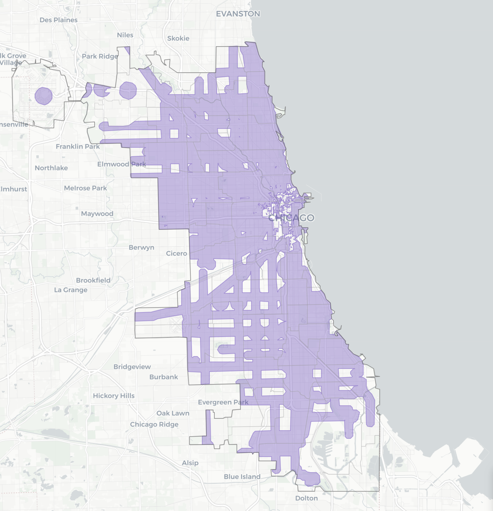

# Chicago Parking Requirement Elimination Map

An interactive GIS analysis and visualization of Chicago's landmark parking mandate elimination ordinance (O2025-0015577), showing where residential developments can now proceed without parking requirements.



## 🌐 Interactive Map

**[View the interactive map online](https://misterclean.github.io/chicago-parking-reform/)**

Explore the interactive map showing Chicago's parking mandate elimination zones directly in your browser.

## 🚇 Overview

On July 16, 2025, Chicago City Council passed ordinance O2025-0015577, dramatically expanding areas where residential developments can be built without parking mandates. This R-based analysis creates an interactive map showing:

- **Purple zones**: No parking requirements - build freely!
- **Orange zones**: Administrative Adjustment required (Metra-only areas)
- **Gray zones**: Downtown carve-out where parking requirements remain

### Key Findings

- **~50% of Chicago** is now free from residential parking mandates
- Properties within ½ mile of CTA rail stations or ¼ mile of designated bus corridors can build without parking
- Only Metra-only areas and downtown districts still require Administrative Adjustments

## 🚀 Quick Start

### Prerequisites

- R (>= 4.0.0)
- RStudio (recommended)
- Internet connection for downloading transit data

### Installation

1. Clone this repository:
```bash
git clone https://github.com/yourusername/chicago-parking-elimination-map.git
cd chicago-parking-elimination-map
```

2. Open the R Markdown file in RStudio:
```r
# In RStudio
File > Open File > chicago_parking_map.Rmd
```

3. Install required packages (the script will auto-install missing ones):
```r
packages <- c("tidyverse", "sf", "leaflet", "leaflet.extras", 
              "httr", "jsonlite", "data.table", "units", "glue")
install.packages(packages)
```

4. Knit the document:
   - Click the "Knit" button in RStudio, or
   - Run: `rmarkdown::render("chicago_parking_map.Rmd")`

## 📊 Data Sources

The analysis uses official data from:

- **Transit Schedules (GTFS)**:
  - [CTA GTFS Feed](https://www.transitchicago.com/developers/gtfs/) - Rail station locations
  - [Metra GTFS Feed](https://metra.com/developers) - Commuter rail stations

- **Geographic Data**:
  - [Chicago Zoning Districts](https://data.cityofchicago.org/Community-Economic-Development/Boundaries-Zoning-Districts-current-/dj47-wfun) - Current zoning polygons
  - [City Boundary](https://data.cityofchicago.org/Facilities-Geographic-Boundaries/City_Boundary/qqq8-j68g) - Official city limits
  - [TSL Route Boundaries](https://gisapps.chicago.gov/arcgis/rest/services/ExternalApps/Zoning/MapServer/14) - Bus corridor buffers

## 🗺️ Methodology

### Transit-Served Locations (TSL)

The ordinance defines TSL as properties within:
- **2,640 feet** (½ mile) of CTA rail station entrances/exits
- **2,640 feet** (½ mile) of Metra station entrances/exits  
- **1,320 feet** (¼ mile) of designated CTA bus corridors

### Zone Definitions

1. **No Parking Requirements** (Purple):
   - Within CTA rail or bus TSL boundaries
   - Outside downtown "D" zoning districts
   - Includes all residential districts (RS, RT, RM)

2. **Administrative Adjustment Required** (Orange):
   - Within Metra station buffers ONLY
   - No overlapping CTA service
   - Still allows parking reduction, but requires city approval

3. **Downtown Carve-out** (Gray):
   - All "D" (downtown) zoning districts
   - Parking requirements remain in effect

### Technical Implementation

The analysis:
1. Downloads real-time GTFS data from CTA and Metra
2. Creates accurate 2,640-foot circular buffers using Illinois State Plane projection
3. Identifies Metra-only areas by excluding all CTA-served zones
4. Clips results to Chicago city boundaries
5. Generates an interactive Leaflet map with multiple layers

## 🐛 Known Issues

- Metra station buffers are calculated from GTFS centerpoints, not actual station entrances

## 🤝 Contributing

Contributions are welcome! Please:

1. Fork the repository
2. Create a feature branch (`git checkout -b feature/amazing-feature`)
3. Commit your changes (`git commit -m 'Add amazing feature'`)
4. Push to the branch (`git push origin feature/amazing-feature`)
5. Open a Pull Request

### Reporting Issues

Found a bug or have a suggestion? Please open an issue on Github.

## 📚 Resources

- [Ordinance O2025-0015577](https://chicago.legistar.com/) - Full text on Chicago Legistar
- [Chicago Cityscape Article](https://www.chicagocityscape.com/blog/parking-mandates-2025.php) - Detailed policy analysis
- [Connected Communities Ordinance](https://www.chicago.gov/city/en/depts/dcd/supp_info/connected-communities-ordinance.html) - Background information
- [Zoning Map](https://gisapps.chicago.gov/zoning/) - Official Chicago zoning map

## 📄 License

This project is licensed under the MIT License - see the [LICENSE](LICENSE) file for details.

---

*This analysis is provided as-is for informational purposes. For official zoning determinations, consult the Chicago Department of Planning and Development.*
